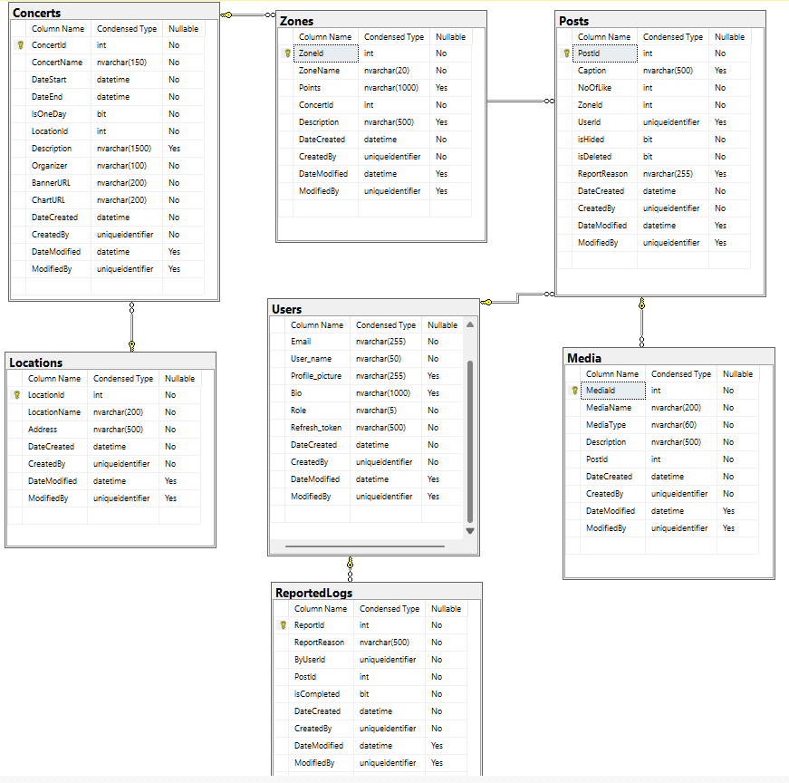
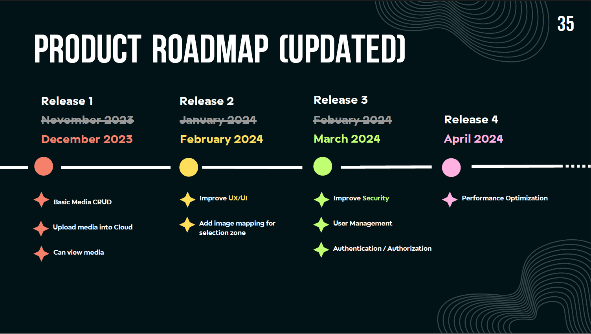

# RhythmRecall_Project
This project is part of INT371 Experiential Learning Project I (1/2023) and INT372Experiential Learning Project II (2/2023) which is the one I am currently studying in thissemester. This project is different from the Integrated Project since Capstone Project willneed everyone to create their own project. Therefore, we have come up with a projectcalled “Rhythm Recall”. It is a web application that allows people to share their photos orvideos inside the concert. Furthermore, each media can be separated into each zone of theconcert. We created this project to make this as a platform of gathering images or videoswith specific concerts and specific zones. Which means, our concept is not just aimed atentertainment but also as a case study for someone who wants to know each venue ofevery zone to guide their decision for the next concert.

## RhythmRecall ER Diagram

Database Code: [RhythmRecall_Database](./RhythmRecall_db.sql)

## Product Roadmap

